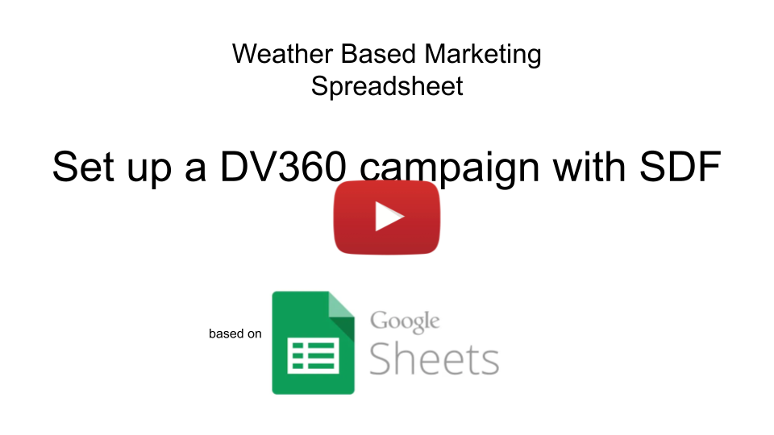
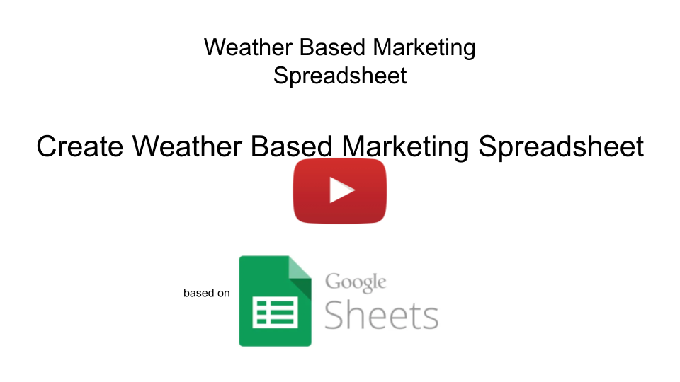
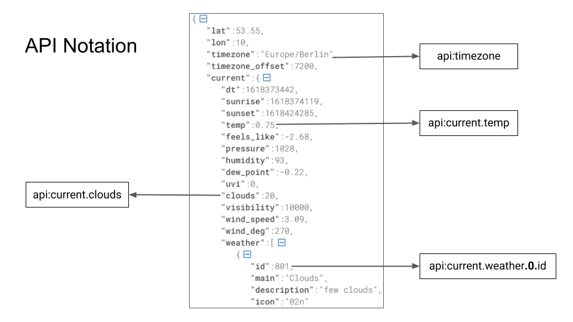
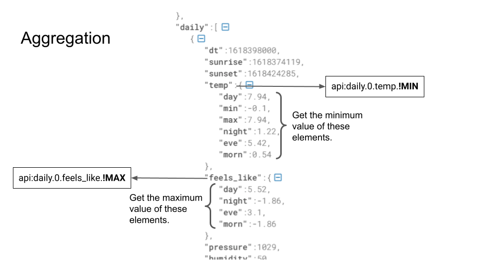

# Weather Based Marketing Spreadsheet

Here you will find information on:
* How to install the Weather Based Marketing Spreadsheet
* How to configure your DV360 campaign fast
* Tweaking your Weather Based Marketing Spreadsheet
* How to configure different weather triggers

## Install (video tutorial can be found below)
1. Copy contents of the [all-in-one.js.txt](all-in-one.js.txt) file to your
    [apps script](https://developers.google.com/apps-script/guides/sheets#get_started) project that connected to the spreadsheet 
    (usually the default file is called "Code.gs").
2. Copy contents of the [appsscript.json](appsscript.json) file to your
    [manifest file](https://developers.google.com/apps-script/concepts/manifests). 
    (Note: first you should [enable](https://developers.google.com/apps-script/concepts/manifests#editing_a_manifest) the file in the project settings).
3. Add your OpenWeather API key ([get the key here](https://openweathermap.org/appid)). In the main code part ([all-in-one.js.txt](all-in-one.js.txt)) find a configuration variable "open-weather-api-key" and paste there your OpenWeather API key (your code should look like it's shown below, but with your own key).
```
  ...
  'open-weather-api-key': '202cb962ac59075b964b07152d234b70',
  ...
```

4. (Optional) If you are going to sync your spreadsheet data to DV360 (e.g. activate/pause the line items) you also need to [set your GCP project](https://developers.google.com/apps-script/guides/cloud-platform-projects) and [enable DV360 API](https://developers.google.com/apps-script/guides/cloud-platform-projects#enabling_an_api_in_a_standard_gcp_project) in that project.

## Video Tutorials
You can follow simple steps shown in the videos below to start using the Weather Based Marketing Spreadsheet.

### Set up a DV360 campaign with SDF
SDF means [Structured Data File](https://developers.google.com/bid-manager/guides/structured-data-file/format). This file is used for the bulk entity management in DV360.

[](http://www.youtube.com/watch?v=Os364xwnHN8 "Set up a DV360 campaign with SDF")
YouTube Link: [youtu.be/Os364xwnHN8](https://youtu.be/Os364xwnHN8).

### Create Weather Based Marketing Spreadsheet
This tutorial will show you main steps for Weather Based Marketing Spreadsheet creation.

[](http://www.youtube.com/watch?v=2UD1QBf9YuQ "Set up a DV360 campaign with SDF")
YouTube Link: [youtu.be/2UD1QBf9YuQ](https://youtu.be/2UD1QBf9YuQ).

## Main Apps Script functions
Here are the main functions that handle communication with the OpenWeather API and sync results to DV360:
* `monitorWeatherAndSyncWithDV360`: will check the settings from the weather triggers spreadsheet, get response from the OpenWeather API, write it back to the spreadsheet and sync the Line Item or Insertion Order status accordingly
* `checkWeather`: will do the same as previous function, but won't sync with DV360

How to run these functions: 
* From the Apps Script development environment (by selecting the function name from the drop-down and [clicking "Run"](https://developers.google.com/apps-script/overview#try_it_out)).
* You can trigger them from the [spreadsheet menu](../imgs/spreadsheet-menu.png): 
  * `monitorWeatherAndSyncWithDV360`: "Weather Based Marketing > Check weather and sync DV360".
  * `checkWeather`: "Weather Based Marketing > Only check weather"
* Schedule them with the Apps Script [Time-driven triggers](https://developers.google.com/apps-script/guides/triggers).

## Configure Apps Script
Main configuration class can be found in the [classes/config.gs](classes/config.gs) file. Here are some of the configuration variables (most of them are optional):
* `open-weather-api-key` (mandatory field): This is an Openweather API key, which you can [get here](https://openweathermap.org/appid) (free version is usually enough).
* `service-account`: To access DV360 API you can use either use a current account (the one, which executed the apps script) or you can use a custom [service account](https://cloud.google.com/iam/docs/service-accounts). If you are going to use a service account, please don't forget to [give the right access](https://support.google.com/displayvideo/answer/2723011?hl=en) for this account in your DV360 settings (since it will activate/deactivate DV360 entities it needs "write" access).
* `spreadsheet-id`: By default main Apps Script functions will check the configuration from the spreadsheet associated with the current Apps Script (a.k.a. [the container](https://developers.google.com/apps-script/guides/bound)).
* `sheet-name`: By default main Apps Script functions will check the configuration from the sheet (tab) called "_Weather Trigger_", but you can change it by specifying another sheet name.
* `hours-between-updates`: This setting allows you to process your spreadsheet in batches. Sometimes you will have a very long table with the weather triggers and locations (imagine you target 5 weather conditions in 50 locations, which equals to 250 rows in the table). At the same time Apps Script has a [limitation](https://developers.google.com/apps-script/guides/services/quotas#current_limitations) on the execution time. You can run your script several times (one after another) and if some rows were already processed during last `hours-between-updates` hours (e.g. during the last run) then these rows will be skipped.
* All `col-*`: Spreadsheet column name configuration, see the section "[Configure the Weather Triggers Spreadsheet](#configure-the-weather-triggers-spreadsheet)".

## Configure the Weather Triggers Spreadsheet
Based on the column names in your trigger configuration sheet (by default named "_Weather Trigger_") main Apps Script decides how to process your list. These names can be configured in the [classes/config.gs](classes/config.gs) file.
This section contains a list of default names of the columns and their purpose:
* 'Line Item Id' (optional, config class variable `col-line-item-id`): The value from this cell will be used to sync the Line Item status (activate it or pause) to DV360 API. First the script tries to sync the Line Item, if this column is not found, then Insertion Order Id will be used to sync.
* 'Insertion Order Id' (optional, config class variable `col-insertion-order-id`): The value from this cell will be used to sync the Insertion Order status (activate it or pause) to DV360 API. If both 'Line Item Id' and 'Insertion Order Id' are empty, then no DV360 sync will be performed.
* 'Advertiser ID' (optional, config class variable `col-advertiser-id`): The value from this cell will be used to sync the Insertion Order or Line Item status (both DV360 API methods require the advertiser id). This field is required if at least one of these fields are not empty: 'Line Item Id' or 'Insertion Order Id'.
* 'Latitude' (mandatory, config class variable `col-lat`): Geo coordinates. Will be used to fetch the weather conditions for the row from the sheet.
* 'Longitude' (mandatory, config class variable `col-lon`): Geo coordinates. Will be used to fetch the weather conditions for the row from the sheet.
* 'Activation Formula' (optional, config class variable `col-formula`): This is a custom formula. It's value is used to activate or deactivate the DV360 entities (e.g. Line Items). If the formula returns `TRUE`, then the DV360 entity will be activated, else (cell contains `FALSE`) it will be paused.
* 'Last Updated' (updated by the script, config class variable `col-last-updated`): This column will be updated automatically by the script and contain the last timestamp when the DV360 entity status was updated.

### 'api:*' Notation (API data points)
These are the columns which will be populated by the script according to the fetched Openweather API output.

The Openweather API output (for the chosen Latitude, Longitude) has a JSON format. You can fetch any particular variable to the corresponding cell from the JSON output by putting a correct variable path to the 'api:*' field name. Especially the format is: `api:<variable>[.<variable>[.<variable>]]`. Where `variable` is a string or integer:
* by specifying integer as a `variable` you can access array elements from the JSON. Remember the array numeration starts from 0 (0 is the first array element, 1 - second, and so on).
* by specifying string as a `variable` you can access JSON properties with the string names.

By default, Openweather API allows you to access different data points, e.g. *temperature, precipitation, sunrise/sunset, pressure, humidity, UV index, clouds, visibility, wind, etc*. 

Examples (you can check the Openweather API [JSON here](https://openweathermap.org/api/one-call-api#example)):
* Column name `api:daily.0.clouds`: will put into the corresponding cell the today's % of clouds.
* Column name `api:daily.0.rain`: will put into the corresponding cell the today's mm of rain.
* Column name `api:daily.0.temp.max`: will put into the corresponding cell the today's maximum temperature (in "°C").
* Column name `api:daily.0.feels_like.!MIN`: this is an aggregated value, the script will find the minimum value among the daily "feels like" temperature array.

#### More examples:




### Activation formula
Activation formula implements the weather conditions which should trigger the marketing action (in our case activate or deactivate the DV360 entities).

Now you know how to extract the needed data points from the weather JSON. Based on these data points you can write your activation formulas.

Here are several examples for the activation formula:
* "Cloudy" (clouds are more than 20%): ` =K2>20` (where "K1" cell contains the name `api:daily.0.clouds`).
* "Cold" (maximum daily temperature is below then 10°C):` =L2<10` (where "L1" cell contains `api:daily.0.temp.max`).
* "Rainy" (at least 15mm per day): ` =M2>=15` (where "M1" cell contains `api:daily.0.rain`).
